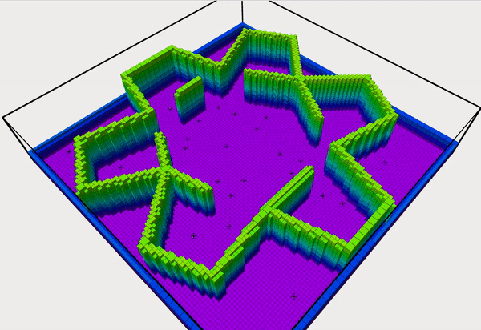

### AMSwarmX 
Repository associated with the paper "AMSwarmX: Safe Swarm Coordination in CompleX Environments via
Implicit Non-Convex Decomposition of the Obstacle-Free Space" **accepted** to IEEE ICRA 2024.

#### Installation

* Clone the repository
* Run the following commands
```
sudo apt-get install ros-<distro>-octomap
sudo apt-get install ros-<distro>-octomap-server
sudo apt-get install ros-<distro>-octomap-ros
sudo apt-get install ros-<distro>-dynamic-edt-3d
sudo apt install libeigen3-dev
```
* CATKIN_IGNORE and build the ```thirdparty``` package and source:
```
catkin_make_isolated -DCMAKE_BUILD_TYPE=Release
source devel_isolated/setup.bash
```
* Build the ```amswarmx``` package
```
catkin_make_isolated -DCMAKE_BUILD_TYPE=Release
source devel_isolated/setup.bash
```
* Supported distro melodic and noetic.

#### Run
Modify configuration file ```simulation.launch``` and ```config_am_swarm.yaml``` as you like. Then run:
```
roslaunch amswarmx simulation.launch
```
#### Example demos
* Bookstore  
   
* Office  
    
* Random room  
    
* Star room  
  

#### Acknowledgement
This package builds upon and uses the below listed packages. Some of the  modified codes can be found in the ```thirdparty``` folder. For the rest of the packages, installation instructions are provided.


* [AMSwarm](https://github.com/utiasDSL/AMSwarm)
* [jps3d](https://github.com/KumarRobotics/jps3d/tree/master)
* [DecompROS](https://github.com/sikang/DecompROS)
* [octomap](https://github.com/OctoMap/octomap)
* [Eigen3](https://eigen.tuxfamily.org/index.php?title=Main_Page)
* [catkin_simple](https://github.com/catkin/catkin_simple)
* [graph_rviz_plugin](https://gitlab.com/InstitutMaupertuis/graph_rviz_plugin)


##### Contact: vivek.adajania@robotics.utias.utoronto.ca
For license, see ```LICENSE``` file.

